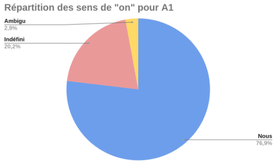

# Annotation manuelle des différents usages du pronom ‘on’ dans les textes des apprenants du français et entraînement d’un classifieur automatique
---

## Sommaire

1. Présentation du Projet et du Corpus
    A. Projet et Problématique
    B. Le Corpus TCFLE-8
    C. Nettoyage du Corpus
2. Résultats Statistiques]
    A. Résultats de l’Annotation Manuelle
    B. Accord Inter-Annotateur
    C. Calcul de Significativité
3. Perspectives linguistiques
4. Entraînement d’un classifieur
    A. Nettoyage des données
    B. Extraction des contextes
    C. Entraînement du classifieur et résultats
5. Conclusion

---
## I - Présentation du Projet et du Corpus

### A) Projet et Problématique

Ce projet s’inscrit dans le cadre du cours nommé “Enrichissement de Corpus”.Il vise à familiariser les élèves à l’annotation manuelle de corpus et leur permet d’appliquer concrètement leurs compétences en TAL et leurs connaissances théoriques en linguistique à des projets universitaires. Notre sujet s’intitule “Annotation manuelle du pronom ‘on’ dans les textes des apprenants du français lors de leur évaluation nationale”. En effet, le pronom personnel indéfini de la 3e personne du singulier en français peut avoir plusieurs interprétations. D’abord, il peut se substituer au pronom pluriel “nous” pour désigner un ensemble de personnes définies dans lequel le locuteur s'inclut explicitement. Par exemple : “On est parti en vacances en Thaïlande avec mon copain cet été”. Il peut aussi avoir un sens plus général comme pour désigner l’ensemble de la population. On retrouve souvent ce type d’emploi du ‘on’ dans des expressions figées et de vérité générale comme “On n'attrape pas les mouches avec du vinaigre” ou encore “On verra bien”. Enfin, il existe
des cas où ces deux interprétations peuvent être aussi valables l’une que l’autre. Par exemple : ”On sait comment ça va finir”. Ici, tout dépend du contexte dans lequel la phrase a été prononcée. Le “on” peut autant inclure un groupe défini de personnes qu’un groupe indéfini plus vaste. On dira alors qu’il est ambigu.

Ce “jonglage” permanent entre “on” définis et indéfinis ne semble pas poser problèmes aux locuteurs natifs du français. Seulement, cette tâche instinctive pour les francophones ne l’est probablement pas pour les allophones. Le pronom “on” n’a pas toujours d’équivalent dans les autres langues. Par conséquent, il est intéressant de se demander comment les apprenants du français utilisent le “on”. Plus précisemment, nous avions deux problématiques précises en tête en commençant ce travail :

- 1) Est-ce que la langue maternelle de l’apprenant influe sur l’usage qu’il fera du pronom “on” ?

- 2) Est-ce que le niveau de français de l’apprenant influe sur l’usage qu’il fera du pronom “on”?

Ainsi, nous avions pour mission à l’issu de ce projet d’annoter manuellement les “on” du corpus fourni par Mme Aykurt-Buchwalter en leur attribuant trois étiquettes (“nous”, “indéfini” et “ambigu”), de rédiger la convention d’annotation en proposant des critères de distinctions entre ces trois emplois et d’entraîner un classifieur automatique qui saurait catégoriser le pronom en fonction de sa sémantique.

### B) Le Corpus TCFLE-8

Le Test de Connaissance du Français Langue Etrangère 8 (1) est un corpus qui regroupe plus de 6500 rédactions d’apprenants du français collectées par l’agence France Éducation International (FEI) sous la tutelle du ministère de l’Éducation nationale. Huit langues étaient représentées : le japonais, le chinois, le russe, l’anglais, l’espagnol, le portugais, l’arabe et le kabyle. Chaque participant était soumis à trois tâches : une première tâche consistait à écrire un court message à but narratif ou informatif, une seconde à écrire un texte plus long avec un certain nombre de mots attendus et une dernière à rédiger un texte argumentatif qui défendait un point de vue.

En revanche, notons qu’il n’est pas précisé quelle rédaction correspond à quelle tâche ni le support sur lequel ils ont écrit (directement à l’ordinateur ? sur papier puis retranscrit par un tiers ou par un logiciel ?). Certains textes nous paraissaient
bizarrement formatés, il est donc légitime de se demander si les données auraient pû être altérées. De plus, les participants n’ont pas tous réussi à répondre aux trois questions demandées et l’absence d'information quant au profil linguistique des locuteurs (trouble dyslexquee ou dysorthographique, niveau de rédaction etc.) constitue une limite supplémentaire à notre recherche.

A l’issue de ce test, en fonction de leurs réponses, les participants se voyaient attribuer un niveau d’acquisition du français allant de A1 à C2 en accord avec le Cadre Européen Commun de Référence pour les Langues (CECRL). Voici le tableau qui récapitule les résultats obtenus :

### C) Nettoyage du corpus

Le corpus fourni en l’état par Mme Aykurt-Buchwalter n’était pas directement exploitable. En effet, le contrat de mise à disposition ne nous permettait pas de le modifier mais surtout, il est présenté en deux parties : un premier tableur csv comprenant les réponses des participants au test accompagnées de leurs numéros d’identification et de leurs niveau de français (A1, A2…), et un second tableur csv
comprenant les profils des candidats : id, langue maternelle, genre, niveau de français,
etc.

Ainsi, nous avons commencé par relier ces deux tables avec un langage SQL pour ne conserver que les données qui nous intéressaient, c’est-à-dire l’id du participant, sa langue, son niveau de français et ses réponses aux différentes questions. Pour ce faire nous avons d’abord récupéré tous les textes d’un certain niveau dans le tableur contenant les réponses aux tâches. Par exemple, nous avons récupéré toutes les lignes de niveau A1 et les avons collé dans une nouvelle feuille contenant uniquement ces lignes. Nous avons fait ça pour tous les niveaux, et nous les avons exportés au format csv. Ensuite, nous avons utilisé SQLite afin d’importer ces tables. Nous avons nos tables “tableauA1”, “tableauA2” etc, ainsi que notre table “metadata” correspondant à la feuille contenant les profils des candidats. Enfin, afin de relier chacune des tables de niveau à la table metadata, nous avons fait une requête
SQL.

## II - Résultats Statistiques

### A) Résultats de l’Annotation Manuelle

Une fois notre corpus nettoyé, nous avons pû passer à l’annotation manuelle. Le corpus de base étant très conséquent, nous ne pouvions pas annoter l’entièreté du corpus. Nous avons donc convenu avec Mme Aykurt-Buchwalter de commencer par le niveau A1 et de continuer d’annoter d’autres niveaux en fonction du temps qu’il nous restait. Finalement, nous avons toutes entièrement annoté les “on” des niveaux A1 et A2 (soit les quatres annotateurs). Nous nous sommes également réparti l’annotation du niveau B2 pour entraîner notre classifieur : trois annotateurs ont divisé le niveau B2 en trois parties et balisé les “on” pour le classifieur.

Voici les résultats que nous avons pû observé. Tout d’abord, concernant notre problématique 2) Est-ce que le niveau de français de l’apprenant influe sur l’usage qu’il fera du pronom “on”, nous pouvons remarquer que plus le niveau de français augmente, plus le participant se sert du “on” indéfini. En effet, les A1 n’utilisent le “on” indéfini que dans 20% des cas, les A2 dans 34% des cas et les B2 dans 49% des cas, et ceux toutes langues confondues :

Cependant, il est important de rappeler que tous les participants n’ont pas répondu à toutes les tâches demandées. Or, la tâche n°3 qui consistait à rédiger un texte argumentatif était la tâche la plus compliquée et qui était la plus susceptible de faire appelle à des “on” indéfini (ex: “on peut voir que”, “on peut penser que”...). Les niveaux A1 et A2 étant débutants en français ont peut-être moins répondu à la tâche n°3. Rappelons aussi que ces tâches ne sont pas de la parole spontanée. Il est donc légitime de se demander si les niveaux débutants utilisent moins le “on” indéfini dans leurs rédactions parce qu’ils le comprennent moins ou parce que la tâche leur semblait trop compliquée et qu’ils n’y ont pas répondu.

Ensuite, concernant notre problématique 1) Est-ce que la langue maternelle de l’apprenant influe sur l’usage qu’il fera du pronom “on”, nous pouvons effectivement observer quelques disparités chez les A1 où les locuteurs de l’espagnol et du kabyle semblent plus à l’aise avec le “on” indéfini (respectivement 28% et 34,6%).

De plus, on observe globalement une forte progression du pronom indéfini chez les A2 chinois (49%), espagnols (57,8%) et arabes (39,7%), alors qu’il progresse plus lentement dans les autres langues et même recule chez les kabyles (25,9%).

Enfin, tous les résultats finissent par s’harmoniser vers un 50/50 au niveau B2. Ces résultats nous ont donc laissé perplexe puisque, bien qu’on puisse constater quelques différences chez les niveaux débutants notamment les locuteurs de l’espagnol qui pourtant n’ont pas d’équivalent du “on” dans leur langue, elles ne semblent pas non plus extrêmement significatives puisque tout finit par s’homogénéiser.
Rappelons également qu’il existe des disparités dans les effectifs. Par exemple, il n’y a que 8 japonais au niveau A1 pour 124 espagnols. Ce chiffre est donc trop petit pour établir des conclusions solides sur l’utilisation du “on” chez cet échantillon d’individus. Par chance, les effectifs eux-aussi finissent pas s'homogénéiser à partir du niveau A2.

### B) Accord Inter-Annotateur

Le calcul de l’accord inter-annotateur est une étape importante de l’annotation manuelle pour estimer la cohérence entre les différents annotateurs. Dans notre cas, nous sommes quatre à avoir annoté les niveaux A1 et A2. Par conséquent, nous avons
voulu calculer le kappa de Fleiss qui, contrairement au kappa de Cohen, permet d’obtenir l’accord entre plus de deux annotateurs. Cependant, il s’est avéré impossible de calculer le kappa de Fleiss avec nos données. En effet, il aurait nécessité un trop
grand tableau au vu du nombre de “on” annotées par nos soins. Nous avons annoté en tout 1064 “on” pour les niveaux A1 et A2. Il était donc beaucoup trop compliqué de retranscrire tous les résultats dans un tableau à 1064 lignes et de calculer les probabilités pour toutes ces lignes. Le kappa de Fleiss convient donc mieux quand peu d’unités ont été annotées.

Nous avons alors trouvé une alternative : calculer le kappa de Cohen pour chaque paire d’annotateurs puis faire la moyenne de tous les kappas. Le kappa de Cohen se calcule ainsi : (P(o) - P(e)) / (1 - P(e)). Autrement dit, on calcule la proportion d’accord observé (o) - la probabilité d’un accord aléatoire (e) divisé par 1 - la probabilité d’un accord aléatoire (e). Une fois que nous avons obtenu le kappa de chaque paire d’annotateurs, nous avons fait la moyenne des kappas. Cela nous donne un kappa de 0,917 pour le niveau
A1 et 0,932 pour le niveau A2. Ces résultats élevés montrent une vraie homogénéité entre nos annotations, mais surtout ils montrent que distinguer les différentes utilisations sémantiques du pronom “on” est une tâche relativemment évidente pour les
locuteurs natifs du français. Nous pensons que même si nous n’avions pas rédigé de guide d’annotation, nous serions arrivées à des résultats similaires. Beaucoup de désaccords venaient du fait qu’il était parfois difficile de comprendre ce que le
participant voulait dire, dû à leur niveau de débutant en français

### C) Calcul de Significativité

Les résultats évoqués précédemment sont intéressants, mais il ne suffit pas de décrire un graphique pour établir un lien de corrélation formel entre deux variables. Nous avons donc voulu procéder à un test statistique qui nous aurait permis de confirmer le lien entre niveau de français et sémantique du “on”. Pour cela, nous nous sommes référées à un arbre de décision (2) pour savoir quel test réaliser. Nous avons déduit qu’il fallait faire un Chi2 pour ce genre de tableau.

Le test du Chi2 consiste calculer la différence au carré entre les valeurs observées et les valeurs théoriques le tout divisé par la valeur théorique. Une fois le calcul du Chi2 réalisé, il faut faire la somme de tous les résultats obtenus, ici 100.34, et la comparer avec la table de distribution du Chi2 en prenant en compte le degré de liberté. Ici, le degré de liberté est de 4 car il correspond à (nb de lignes - 1) x (nb de colonnes - 1) donc 2x2. Le seuil donné par le degré de liberté est de 9.488. Comme 100.23 > 9.488, on peut rejeter l’hypothèse nulle et conclure qu’il existe bel et bien un lien entre niveau de français et sémantique du “on”.

Enfin, notez qu’il était impossible d’effectuer un Chi2 sur le lien entre les langues et la sémantique du “on” dû au trop faibles nombres de données dans le tableau des valeurs théoriques. En effet, beaucoup de cases étaient remplies avec des nombres < 5, or le Chi2 nécessite des valeurs > 5. Nous aurions pu faire un test exact de Fisher à la place du Chi2 si seulement il s’agissait d’un tableau 2x2 et non d’un tableau 3x8 (pour trois étiquettes et 8 langues).

## III - Perspectives linguistiques

Au cours de notre travail, nous avons pu remarquer l’usage fréquent de formes mal orthographiées traduisant le pronom “on”, il a donc été primordial de prendre davantage de temps à l’extraction de ces formes dans les énoncés du corpus, afin de repérer toutes les occurrences obligatoires à notre recherche. Le sujet de cette partie permet d’analyser et de justifier ces formes, en comparant “on” /õ/ aux autres phonèmes disponibles dans les langues étudiées.

Afin de comprendre les formes erronées rencontrées ayant pour valeur le pronom “on” dans les deux niveaux, nous avons donc tenté d’élaborer des hypothèses linguistiques permettant de justifier ces “erreurs”. Le tableau ci-dessous regroupe les
différentes langues étudiées, les éléments lexicaux comportant les confusions phonémiques extraites du corpus, soit “en” /ã/ (voire /en/ ou /ɛn/), “un” /un/, “ou” /u/, mais aussi ona / one et ons/ ont et leur nombre d’occurrence :

Nous pouvons dès lors exclure le japonais (qui ne possède aucune faute dans l’écriture du pronom), car il n’y avait que trop peu d’énoncés pour qu’une hypothèse soit parfaitement représentative de régularités phonologiques. De plus, certaines confusions
ne peuvent permettre une conclusion généralisée au vu de leur usage trop peu fréquent, par exemple : en chinois (2 au total), en espagnol et en portugais (1 respectivement au total), en russe et anglais (7 au total pour chaque langue). Dans ce
type de cas de figure, nous pouvons avancer l’hypothèse de la faute d’orthographe ponctuelle et/ou individuelle.

En revanche, l’arabe et le kabyle présentent au total 67 occurrences erronées, principalement “en”, et ce dans les deux niveaux de langues. Si nous observons le système vocalique dans ces langues sémitiques et berbères, nous découvrons qu’elles possèdent les phonèmes : \[a] , \[i] (prononcé entre le \[i] et le \[e] français), et \[u]. Il est donc possible que les locuteurs arabophones et kabylophones, prononcent et - par extension - écrivent des formes au plus proche de ce qu’ils entendent et comprennent,
c’est-à-dire d’autres formes que le son français “on” /õ/.

D’autre part, nous relevons des formes de type ona / one n’ayant aucune régularité attestée selon les langues. La remarque la plus probable serait donc l'interprétation d’une forme figée de la part des apprenants, i.e le groupe verbal
composé distinctement du pronom “on” et des auxiliaires être et avoir (“on a” et “on est”) est compris comme un seul lexème, car très probablement si fréquent qu’il en devient pour les locuteurs une seule et même forme.

Enfin, une erreur d’ordre orthographique issue d’une confusion phonologique (homonymie) toute aussi fréquente indique la non-reconnaissance de deux formes opposant le pronom personnel “on” à deux formes :

- Le verbe avoir à 3 p.p “ont” : L’homophonie de ces deux mots et la connaissance des deux lexèmes peuvent mener à confondre leur nature et donc à terme leur usage.

- Un pronom agrammatical “ons” : Celui-ci pose deux hypothèses. Premièrement, la transposition de la forme “Nous” prononcée /nu/ mais
ayant un “s” final à l’écrit sur le pronom “on” /õ/ qui donnerait par processus de calque cognitif “ons”. D’un autre côté, le pronom désignant sémantiquement plusieurs agents, l’accord avec un “s” pluriel serait considéré comme automatique venant d'apprenants qui ont intégré l’une des premières et plus importantes règle d’accord en nombre du français

## IV - Entraînement d’un classifieur

### A) Nettoyage des données

Afin d’entraîner notre classifieur, nous avons sélectionné les textes de niveau B2. En effet, nous avons trouvé préférable de sélectionner des textes de ce niveau, car c’est un niveau assez avancé, et ainsi, nous avions plus de chances d’y trouver des usages variés de “on”, et non pas juste des “nous” familiers. De plus, c’est un niveau où nous rencontrons de moins en moins de fautes d’orthographe et où tous les “on” sont correctement orthographiés, sauf rares exceptions. Nous avons donc annoté ces textes à part, sans faire d’accord inter-annotateurs. De plus, nous avons également ajouté des balises à chaque fois que nous rencontrons des “on”, cela afin de pouvoir facilement retrouver ces “on” avec nos scripts. Ces balises sont : <n></n> pour les “on” équivalents à “nous” et <i></i> pour les “on” qui sont des indéfinis. Nous avons décidé de ne pas entraîner le classifieur sur les cas ambigus car ces cas étaient minoritaires dans le niveau B2.

Avant de coder le classifieur, nous avons nettoyé les données récoltées sur B2 afin de les transformer en un format utilisable par le classifieur. Nous avons exporté le tableur en format csv, en retirant toutes les colonnes qui ne sont pas les textes. Ensuite,
nous avons rédigé [le script filtrer_corpus](filtrer_corpus.py) qui ouvre un fichier contenant notre corpus B2 exporté en csv, et en parcourt chaque ligne afin de ne garder uniquement les lignes contenant des “on”, qu’on trouve grâce à une expression régulière sur les balises. Nous en profitons également pour retirer les balises   qui étaient présentes dans le corpus et qui n’apportent pas d’informations pour le classifieur. On retourne ainsi le corpus sous forme de listes de lignes contenant des “on” et grace a la dernière fonction on met tout ca dans un fichier csv.

Cela ne suffit pas pour notre classifieur : en l’état, nous avons juste des lignes contenant des “on”, ces lignes pouvant contenir plusieurs “on”. Nous devons extraire chaque “on” individuel et leur contexte.

### B) Extraction des contextes

Nous avons à cette fin écrit un autre script nommé [extraction_contexte](extraction_contexte.py) permettant d’extraire les contextes gauche et droit autour de chaque “on”. Il prend en entrée le fichier csv contenant le corpus filtré par notre script précédent, qu’il transforme en objet DataFrame avec la librairie pandas. On itère sur chaque ligne du DataFrame (correspondant à chaque ligne du csv). Pour chaque occurrence de “on”, le script crée un dictionnaire contenant le contexte gauche, le contexte droit, ainsi que le label associé au “on” grâce à sa balise (qu’on retire au passage). Le dictionnaire ne comprend pas le “on” lui-même, car il n’est pas nécessaire. Le classifieur, pour classer les “on”, classifie en réalité le contexte autour du “on”. Nous avons choisi arbitrairement un contexte de 10 mots à gauche et à droite, sachant que ce contexte peut être réduit si le script rencontre de la ponctuation finale, auquel cas il s’arrête au niveau de la ponctuation. En sortie, nous avons une liste de dictionnaires qui correspondent à chaque “on”. Nous exportons ce dictionnaire en fichier json grâce à la librairie json.

### C) Entraînement du classifieur et résultats

Nous avons entraîné [nos modèles](classifieur_on.py) de classifieur grâce à la librairie scikitlearn sur python. Nous avons choisi d’employer un modèle de régression logistique (LogisticRegression sur sklearn) car c’est un modèle adapté au problème de classification binaire, ce qui rentre dans notre cas, puisque nous avons uniquement deux classes : nous familier et on indéfini.

Nous avons entraîné le modèle de deux façons. D’un côté, en séparant notre corpus en deux sous-corpus de test et de train, dans un ratio 20-80. D’un autre côté, en séparant le corpus dans un ratio 10-90 (respectivement test et train), puis en faisant de
la cross-validation à 10 plis sur le corpus train afin de générer 10 modèles qu’on teste ensuite sur le corpus test. Nous avons créé pour cela deux fonctions différentes, et qui sont appelées selon le choix de l’utilisateur : “cross” en argument du script si on souhaite la validation croisée, “split” si on souhaite la division simple du corpus. Notre fonction split permet de visualiser en temps réel les prédictions du modèle pour chaque “on” du corpus, de calculer le kappa de Cohen et de visualiser la matrice de confusion. La fonction cross affiche les scores d’accuracy pour chaque modèle, ainsi que la moyenne des scores de tous les modèles.

Les résultats que nous avons obtenus avec ces deux méthodes sont similaires : pour le split, nous obtenons environ 85% d’accuracy. Le kappa de Cohen quant à lui tourne autour de 0.7, signifiant que le modèle performe mieux que le hasard. Voici un
exemple de matrice de confusion obtenue :

La première colonne correspond aux “nous” trouvés par le classifieur, la deuxième colonne correspond aux “on” indéfini trouvés par le classifieur; la première ligne correspond aux occurrences réelles de “nous” et la deuxième correspond aux occurrences réelles de “on” indéfini. En diagonale, nous avons donc les vrais positifs. Autrement dit, 107 “nous” trouvés par le classifieur en sont réellement, tandis que 7 “on” indéfini ont été classifiés à tort comme étant des “nous”. 99 occurrences de “on” indéfini ont bien été trouvés par le classifieur, avec 19 faux positifs qui sont en réalité des “nous”. Nous avons donc avec cette méthode pour la classe “nous” un rappel de 0,85 et une précision de 0,94, ce qui nous fait une f-mesure de 0,90. Pour la classe “indéfini” nous avons un rappel de 0,93 et une précision de 0,84 ce qui nous fait une f-mesure de 0,88. En moyenne, nous avons donc un rappel de 0,89, une précision de 0,89 et une f-mesure de 0,89. Nous pouvons voir qu’il n’y a un léger déséquilibre du côté des “on” indéfini trouvés par le classifieur, puisque nous avons légèrement plus de faux positifs pour la classe des “on” indéfinis. Autrement dit, le classifieur a légèrement tendance à classifier les “on” indéfini comme étant des “nous” de manière plus récurrente qu’il ne le fait avec les “nous” familiers, pour lesquels il se trompe plus rarement. Néanmoins, nous avons fait tourner le script plusieurs fois, et il arrive que ce déséquilibre n’apparaisse pas.
Avec la cross validation à 10 plis, nous obtenons également environ 85% d’accuracy sur le corpus train, et 83% d’accuracy sur le corpus test. Les scores des 10 modèles générés vont de 80% à 90% d’accuracy sur le corpus train, il n’y a donc pas une grande disparité de qualité entre les modèles.

Ce modèle n’est évidemment pas abouti, et mériterait d’être affiné. On peut se demander si le contexte que nous avons extrait est trop court, et ne comporte pas assez d’indices pour le classifieur. De plus, nous avons aussi une surreprésentation de “nous” familier, donc il est également possible que le classifieur n’a pas rencontré assez de contextes de “on” indéfini et ainsi ne parvient donc pas à certains types de contextes de “on” indéfini. Notre corpus lui-même est peut-être aussi d’une taille insuffisante. Il n’y a peut être tout simplement pas assez d’occurrences de “on” indéfini en général. Par exemple, nous avons rencontré peu d’occurrences de l’utilisation de l’utilisation “on m’a…”, alors que ce “on” est constamment indéfini et n’est pas ambigu. Si le modèle avait eu accès à beaucoup de ces occurrences de ces constructions, il aurait pu probablement classer ces cas de manière fiable.

## V - Conclusion

Ce projet nous a permis de croiser des compétences en linguistique et en traitement automatique des langues, autour de l’utilisation du pronom “on”. Nous avons exploré ses différents usages : indéfini, défini (équivalent à “nous”) et ambigu, dans des productions écrites d’apprenants du français.

Dans un premier temps, un travail de nettoyage et de structuration du corpus a été nécessaire afin d’isoler les textes pertinents et de les rendre exploitables. Ce travail, réalisé avec des comme Google Sheets et SQLite, a posé les bases de l’annotation manuelle. Nous avons alors conçu une guide d’annotation puis appliqué cette annotation sur les niveaux A1, A2 et B2. L’analyse statistique de ces annotations a mis en évidence des tendances intéressantes : plus le niveau de langue est élevé, plus l’usage du “on” indéfini augmente, ce qui confirme l’hypothèse d’un lien entre niveau linguistique et maîtrise des emplois du pronom “on”. Malgré les limites du corpus (déséquilibre des effectifs, peu d’informations sur les locuteurs…), nos résultats permettent d’esquisser une typologie d’erreurs et d’usages selon les langues maternelles. L’analyse statistique a montré qu’il n’y avait pas forcement de lien entre la langue maternelle de l’apprenant et son usage du “on”. Par ailleurs, les scores élevés des accords inter-annotateurs ont confirmé la robustesse de notre protocole et la relative facilité à distinguer les usages du “on” pour un locuteur natif.

Dans un second temps, nous avons développé un classifieur automatique à l’aide de Python et de la bibliothèque scikit-learn. Ce modèle, basé sur une régression logistique, a été entraîné à partir de contextes extraits autour de chaque occurrence du pronom, à partir du niveau B2 uniquement. Nous avons fait le choix d’exclure les cas ambigus pour simplifier la tâche du modèle. Le traitement automatique du contexte a nécessité un script dédié, capable d’isoler jusqu’à dix mots avant et après chaque “on”, tout en tenant compte de la ponctuation. Une fois les données prêtes, le classifieur a été testé selon deux modalités : une simple séparation train/test, et une validation croisée à 10 plis. Les résultats sont globalement satisfaisants, avec une précision tournant autour de 85 %, et un kappa de Cohen autour de 0,7. Le modèle parvient généralement à bien distinguer les deux catégories, même si certains contextes restent difficiles à interpréter.

En somme, ce projet a mis en lumière la complexité des usages du pronom “on”, tout en montrant qu’un classifieur automatique, même simple, peut atteindre des performances intéressantes à partir d’un corpus bien préparé. Pour aller plus loin, il serait pertinent d’enrichir le corpus, notamment avec des occurrences plus variées de “on” indéfini, d’introduire les cas ambigus, et d’explorer d’autres types de modèles, éventuellement plus sophistiqués. Ce travail pose ainsi les bases d’un projet plus large, à la croisée de la linguistique et de l’intelligence artificielle appliquée au langage.

